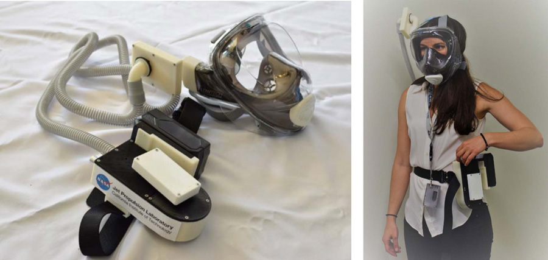

 
# JPL Designed Powered Air-Purifying Respirator (PAPR)

In order to help provide Personal Protective Equipment (PPE) for the Coronavirus pandemic, a team at NASA’s Jet Propulsion Laboratory (JPL) has created and tested a 3D printable Powered Air-Purifying Respirator (PAPR) device with custom filters and Commercial Off-The-Shelf (COTS) components. Utilizing a Wildhorn Outfitters® Full Face Snorkel Mask and other COTS equipment, the JPL design is available for use by motivated creators in an Open Source forum readily accessible by anyone wishing to produce the device. Some testing has been performed by JPL and others to verify that it meets the design requirements identified in Public Health Title 42, Code of Federal Regulations, Part 84, but it lacks any NIOSH or other medical institution approval. The device is intended to provide a last line of defense when certified PAPRs are not commercially available.
 
## Getting Started

Read the [full documentation](docs/PAPR_Background_and_Instructions.pdf) to get started. Be sure to reference this document when reviewing the bill of materials and build files listed below.

➡️ [Full Documentation](docs/PAPR_Background_and_Instructions.pdf) 

## Materials Required

The JPL PAPR team has generated a [Bill of Materials (BOM)](docs/Bill_of_Materials.xlsx) for each of the two separate PAPR configurations. The PAPR System top assembly part number is 15180125 with the -1 version signifying the Globe Tools Blower version, and the -2 version signifying the ebmpapst Blower Motor version. These two different versions are functionally the same but slight design changes are included to manage the differences in the blower motor designs. The individual shopping lists are included as separate tabs in the BOM spreadsheet:

➡️ [Bill of Materials (BOM)](docs/Bill_of_Materials.xlsx)

## Build Files

Although the JPL PAPR design uses COTS parts, JPL designed 3D printed parts to package and support these COTS items so the system can perform the intended function. 3D printing enables the home user to download and fabricate these parts independently. The PAPR System top assembly part number is 15180125 with the -1 version signifying the Globe Tools Blower version, and the -2 version signifying the ebmpapst Blower Motor version. These two different versions are functionally the same but slight design changes are included to manage the differences in the blower motor designs.

➡️ [15180125-1 STL Files](15180125-1%20Globe%20Tools%20Blower) (Globe Tools Blower)  
➡️ [15180125-2 STL Files](15180125-2%20ebmPapst%20Blower) (ebmPapst Blower Motor)
